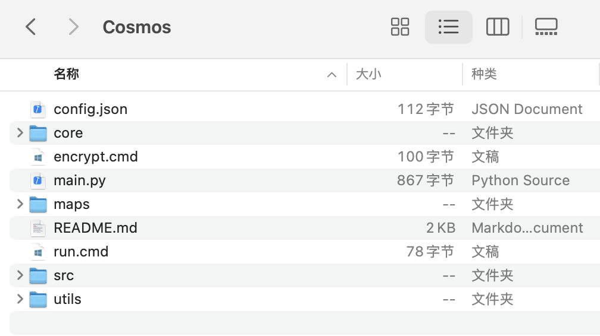
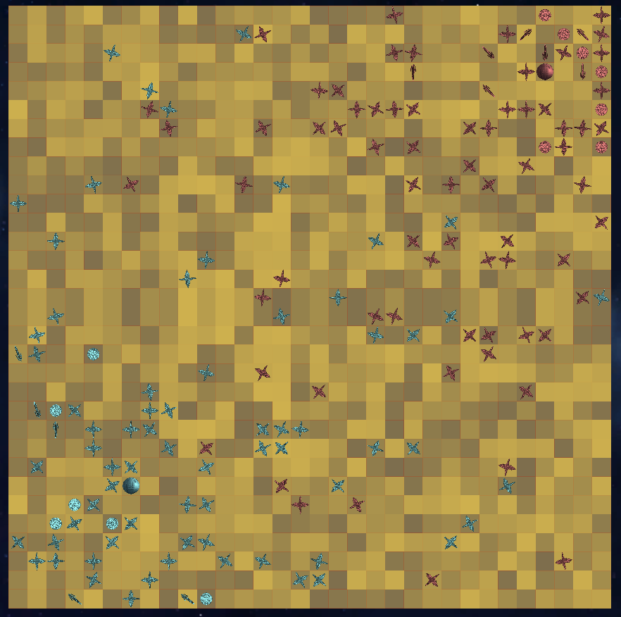

## 从零开始的 Cosmos 生活

这是一份从零开始的 Cosmos 攻略，在这里面我们将从头开始搭建运行比赛的环境，并且设计一个拥有基础策略的游戏AI。

### 0x01 - 搭建环境

要运行比赛，我们首先需要配置游戏的运行环境。

如果你本地已经配置好 Python 环境，你可以直接从 GitHub 上下载最新版本的[代码](https://github.com/NGMAAAYO/Cosmos/tree/main)。

如果本地并没有 Python 环境且是 Windows 系统，也可以直接从 [Releases](https://github.com/NGMAAAYO/Cosmos/releases/latest/) 页面下载一个包含 Python 3.12 的可执行文件的压缩包。

下载（并解压）后的文件夹如下所示：

<p align="center">
    
</p>

### 0x02 - 运行比赛 & 查看录像

要想运行一场比赛，我们需要配置这场比赛的详细信息，也就是修改位于根目录下的 `config.json` 文件。此文件默认内容如下：

```json
{
	"rounds": 1000,
	"map": "maptestsmall",
	"players": [
		"example",
		"example"
	],
	"debug": true
}
```

这将会在名为 `maptestsmall` 的地图上运行一次一共 1000 回合的比赛，其中双方都使用名为 `example` 的代码策略。

debug 参数被设为 `true` 后，我们的代码如果有任何语法错误或者运行时错误，将会打印完整信息并且中断比赛。与此同时，游戏的随机种子将会固定，这意味着对于相同的代码，无论何时运行都会用相同的输出。

这些功能对于调试开发非常有用，因此我们不作修改。

命令行运行 `python main.py` 即可开始比赛。如果你在配置时从 Releases 中下载了压缩包，可以直接双击 `run.cmd` 或者运行 `python\python.exe main.py` 运行。

执行结果：

```bash
> python main.py
胜者：example
原因：队伍所有实体的总能量更高。
========
[Team 0] example 剩余实体：
planet: 1 平均能量：332.00
destroyer: 5 平均能量：1283.00
miner: 6 平均能量：1314.33
scout: 69 平均能量：982.84
========
[Team 1] example 剩余实体：
planet: 1 平均能量：139.00
destroyer: 7 平均能量：470.71
miner: 7 平均能量：620.57
scout: 70 平均能量：764.24
========
中立实体：0
回放已保存至：./replays/replays-debug.rpl
```

此时，在 `/replays/` 文件夹下已经出现了名为 `replays-debug.rpl` 的录像文件。

要想播放录像文件，可以访问[在线回放工具](https://cosmos.misaka17032.com/visualizer)。打开网页后会先黑屏一段时间加载资源，等出现星空背景后将录像文件拖入浏览器窗口即可开始播放。

另外一种方法是在[这个工程](https://github.com/NGMAAAYO/Cosmos-Client)中按步骤下载并配置客户端。本教程不会深入探讨这种办法，并且默认使用网页端工具。

播放刚刚的回放，我们可以看到两个 `example`的实例都只会进行随机的行为。在游戏末尾，它们仍然处于均势：

<p align="center">
    
</p>

### 0x03 - 添加自定义策略

要增加一个可以运行的“玩家”代码，我们需要在 `/src` 文件夹下新建一个文件夹，文件夹名字只能含有字母和数字（不能含有空格），并且开头不能是数字。我们在 `src` 下创建一个名为 `baseline1` 的文件夹，这也将是我们要填写进配置文件中的 `player` 名字。

接下来，我们的文件夹里面必须有一个 `main.py`，并且里面必须定义一个 `Player` 类。我们使用以下模版，复制进 `/src/baseline1/main.py` 里：

```python
from src import template
from core.api import *

class Player(template.Player):
	def __init__(self):
		super().__init__()

	def run_planet(self):
		pass

	def run_destroyer(self):
		pass

	def run_miner(self):
		pass

	def run_scout(self):
		pass
```

接下来，我们修改 `config.json` 中的值。为了方便起见，我们暂且将总轮数修改为 500 轮，这样我们开发时可以快速验证我们的代码：

```json
{
	"rounds": 500,
	"map": "maptestsmall",
	"players": [
		"baseline1",
		"example"
	],
	"debug": true
}
```

运行游戏，我们得到以下结果：

```bash
胜者：example
原因：最终兵器有更多的能量点。
[0, 500]
========
[Team 0] baseline1 剩余实体：
planet: 1 平均能量：1900.00
destroyer: 0 平均能量：0.00
miner: 0 平均能量：0.00
scout: 0 平均能量：0.00
========
[Team 1] example 剩余实体：
planet: 1 平均能量：711.00
destroyer: 45 平均能量：200.49
miner: 23 平均能量：477.48
scout: 28 平均能量：317.46
========
中立实体：0
回放已保存至：./replays/replays-debug.rpl
```

我们目前的 `baseline1` 能够成功作为一个玩家代码运行比赛，不过它的策略是什么也不做。我们需要让它变成一个“真正意义上”的策略。

### 0x04 - 制造策略 & 充能策略

在游戏一开始，我们只有初始的星球。要想控制其他实体，我们需要先用星球制造出它们。

观察地图，我们可以发现两个基地之间的距离较远，这意味着前期我们的基地相对安全，不会和其他玩家接触。我们应该采用探索控图和优先发育的策略。

同时，由于充能机制的存在，我们也需要考虑对于充能的投入。前期资源相对匮乏，我们应该优先发育。

也就是说，前期我们优先制造开采舰和侦查舰，后期当我们资源充足的时候，我们可以再大量制造战列舰和大量充能。

我们采用以下策略：

```python
import random

def try_build(self, type, energy, direction=None):
	# 先定义一个helper function，用以帮助建造实体
	# 尝试建造一个单位，如果没有指定方向，则顺时针依次尝试每一个方向。
	if self.controller.get_energy() < energy:  # 如果能量不足，直接返回False
		return False
	if direction is None:  # 如果没有指定方向，则尝试所有方向
		direction = Direction.all_directions()
	else:
		direction = [direction]
	for d in direction:  # 遍历所有方向
		if self.controller.can_build(type, d, energy):
			self.controller.build(type, d, energy)
			return True
	return False

def run_planet(self):
	# 所有的操作都通过self.controller执行，包括获取信息和行动
	current_round = self.controller.get_round_num()  # 获取当前回合数
	current_energy = self.controller.get_energy()  # 获取当前能量

	if self.controller.is_ready():  # 如果现在冷却值足够行动，则开始决定建造什么
		if current_round <= 100:  # 前100回合（前期）
			if current_energy > 100:
				# 如果能量大于100，则有30%概率建造一个destroyer，70%概率建造一个miner
				if random.random() > 0.7:
					self.try_build(EntityType("destroyer"), 30)
				else:
					self.try_build(EntityType("miner"), 75)
			elif current_energy > 30:
				# 如果能量值在30到100之间，则建造一个miner
				self.try_build(EntityType("miner"), 30)
			else:
				self.try_build(EntityType("scout"), 1)  # 如果能量小于30，则建造一个最便宜的scout
		else:  # 后期
			if current_energy > 200:
				# 如果能量大于200，则有80%概率建造一个destroyer，20%概率建造一个miner
				if random.random() > 0.2:
					self.try_build(EntityType("destroyer"), 60)
				else:
					self.try_build(EntityType("miner"), 100)
			elif current_energy > 75:  # 如果能量值在75到200之间，制造小型destroyer
				# 我们需要保证星球有一定能量储备，防止出现意外
				self.try_build(EntityType("destroyer"), 30)
			else:
				self.try_build(EntityType("scout"), 1)
	
	# 充能不占冷却，因此每轮都进行充能判定
	if self.controller.get_charge_point() > 500:
		return  # 如果已经有大于500点的充能，那我们就不需要再充能了
	if current_round < 100:
		pts = 1  # 前100回合，充能1点，如果对面不充能的话就可以获得一点
	elif current_round < 500:  # 中期充能20%
		pts = self.controller.get_energy() // 5
	else:  # 后期充能1/3
		pts = self.controller.get_energy() // 3
	
	if self.controller.can_charge(pts):
		self.controller.charge(pts)
```

加上这些代码后运行比赛，我们发现我们的星球已经开始建造实体并充能了，不过现在建造出来的实体围在星球周围不移动，导致星球无法建造新的实体。

我们将在下一节开始编写其他实体的策略。

### 0x05 - 探索策略 & 侦查舰

我们的实体需要探索地图。为了能够遍历整张地图，我们采用左手法则作为寻路策略：即遇到障碍物尝试左转：

```python
def __init__(self):
	super().__init__()
	self.explore_dir = None  # 当前探索方向
	self.home_loc = None  # 母星位置，初始为None

def explore(self):  # 探索逻辑
	if self.explore_dir is None:
		# 如果探索方向没有被初始化，说明此时这个实体刚被创建出来。这意味着制造它的星球就在旁边。
		# 我们将初始探索方向设置为这个实体面向的方向。
		for entity in self.controller.sense_nearby_entities(radius=2, teams=[self.controller.get_team()]):
			# 遍历四周所有的同队实体
			if entity.type == EntityType("planet"):
				# 找到母星后，将探索方向设置为母星指向当前实体的方向
				self.explore_dir = entity.location.direction_to(self.controller.get_location())
				self.home_loc = entity.location  # 记录母星位置
				break
	
	if self.controller.is_ready():  # 如果实体可以行动
		for _ in range(8):  # 尝试8次探索，均失败说明四周全被堵死
			if self.controller.can_move(self.explore_dir):
				self.controller.move(self.explore_dir)
				return
			self.explore_dir = self.explore_dir.rotate_left()  # 左手法则
```

这样的话，我们就写好了一个通用的探索方法。接下来，我们开始实现侦察舰的算法。

考虑到侦察舰的主要目标是消灭对方的开采舰，我们优先判定周围是否能找到敌对开采舰，然后再探索：

```python
def run_scout(self):
	# 检查四周是否有敌人的miner
	for entity in self.controller.sense_nearby_entities(teams=self.controller.get_opponent()):
		if entity.type == EntityType("miner"):
			# 如果发现敌人的miner，则攻击它
			if self.controller.can_analyze(entity.location):
				self.controller.analyze(entity.location)
				return  # 如果直接分析成功，则进入冷却，可以直接跳过回合
			# 如果不能分析，那么说明要么自身在冷却中或者距离不够
			# 我们直接向敌人的方向接近
			d = self.controller.get_location().direction_to(entity.location)
			if self.controller.can_move(d):
				self.controller.move(d)
				return  # 如果移动成功，同理，可以直接跳过回合
	
	# 如果没有发现敌人的miner，则继续探索
	self.explore()
```

运行比赛，我们可以看到侦察舰已经会自发开始探索并且消灭 example 的开采舰。

### 0x06 - 战列舰

对于战列舰，我们采用一个很简单的算法：优先攻击敌方星球，其次探索地图。代码很大程度上和侦察舰一样：

```python
def run_destroyer(self):
	# 检查四周是否有敌方planet
	for entity in self.controller.sense_nearby_entities(teams=self.controller.get_opponent()):
		if entity.type == EntityType("planet"):
			# 如果发现敌人的planet，为了最大化伤害，我们优先接近
			d = self.controller.get_location().direction_to(entity.location)
			if self.controller.can_move(d):
				self.controller.move(d)
				return
			# 如果无法更接近了，我们就直接攻击
			dis = self.controller.get_location().distance_to(entity.location)
			if self.controller.can_overdrive(dis):
				self.controller.overdrive(dis)
				return
	
	# 如果没有发现敌人的planet，则继续探索
	self.explore()
```

此时运行比赛，我们发现第一波建造的开采舰在300回合后进化成的战列舰已经能够把 example 的基地攻占下来了！

### 0x07 - 开采舰

对于开采舰，我们同样使用一种很基本的策略：如果检测到敌方侦察舰，无论如何直接反方向逃跑。否则，在距离母星一定距离内使用 explore 方法移动。以下是代码实现：

```python
def run_miner(self):
	if self.explore_dir is None:
		self.explore()
		return  # 如果探索方向没有被初始化，则直接开始explore
	if not self.controller.is_ready():
		return  # 如果实体不能行动，则直接返回
	# 检查四周是否有敌人的scout
	for entity in self.controller.sense_nearby_entities(teams=self.controller.get_opponent()):
		if entity.type == EntityType("scout"):
			# 如果发现敌人的scout，则向反方向逃跑
			d = entity.location.direction_to(self.controller.get_location())  # 对方指向自己的方向
			if self.controller.can_move(d):
				self.controller.move(d)
				return  # 直接逃跑

	# 如果没有发现敌人的scout，则继续探索
	dis = self.controller.get_location().add(self.explore_dir).distance_to(self.home_loc)  # 探索后距离母星的距离
	for _ in range(8):  # 尝试8次移动，均失败说明四周全被堵死
		if dis > 20:  # 如果距离母星大于20，则旋转方向
			self.explore_dir = self.explore_dir.rotate_left()  # 左手法则
		else:
			self.explore()  # 如果距离母星小于20，则继续探索
		dis = self.controller.get_location().add(self.explore_dir).distance_to(self.home_loc)
```

此时，运行游戏，我们已经能够发现 baseline1 能够稳定胜过 example 了。

### 0x08 - 结语

此时，我们将 `config.json` 修改为标准游戏的配置：

```json
{
	"rounds": 1000,
	"map": "maptestsmall",
	"players": [
		"baseline1",
		"example"
	],
	"debug": true
}
```

并且确保 baseline1 的实现与以下相符：

<details close>
	<summary>展开完整代码</summary>

```python
import random

from src import template
from core.api import *

class Player(template.Player):
	def __init__(self):
		super().__init__()
		self.explore_dir = None  # 当前探索方向
		self.home_loc = None  # 母星位置，初始为None
	
	def try_build(self, type, energy, direction=None):
		# 先定义一个helper function，用以帮助建造实体
		# 尝试建造一个单位，如果没有指定方向，则顺时针依次尝试每一个方向。
		if self.controller.get_energy() < energy:  # 如果能量不足，直接返回False
			return False
		if direction is None:  # 如果没有指定方向，则尝试所有方向
			direction = Direction.all_directions()
		else:
			direction = [direction]
		for d in direction:  # 遍历所有方向
			if self.controller.can_build(type, d, energy):
				self.controller.build(type, d, energy)
				return True
		return False

	def run_planet(self):
		# 所有的操作都通过self.controller执行，包括获取信息和行动
		current_round = self.controller.get_round_num()  # 获取当前回合数
		current_energy = self.controller.get_energy()  # 获取当前能量

		if self.controller.is_ready():  # 如果现在冷却值足够行动，则开始决定建造什么
			if current_round <= 100:  # 前100回合（前期）
				if current_energy > 100:
					# 如果能量大于100，则有30%概率建造一个destroyer，70%概率建造一个miner
					if random.random() > 0.7:
						self.try_build(EntityType("destroyer"), 30)
					else:
						self.try_build(EntityType("miner"), 75)
				elif current_energy > 30:
					# 如果能量值在30到100之间，则建造一个miner
					self.try_build(EntityType("miner"), 30)
				else:
					self.try_build(EntityType("scout"), 1)  # 如果能量小于30，则建造一个最便宜的scout
			else:  # 后期
				if current_energy > 200:
					# 如果能量大于200，则有80%概率建造一个destroyer，20%概率建造一个miner
					if random.random() > 0.2:
						self.try_build(EntityType("destroyer"), 60)
					else:
						self.try_build(EntityType("miner"), 100)
				elif current_energy > 75:  # 如果能量值在75到200之间，制造小型destroyer
					# 我们需要保证星球有一定能量储备，防止出现意外
					self.try_build(EntityType("destroyer"), 30)
				else:
					self.try_build(EntityType("scout"), 1)
		
		# 充能不占冷却，因此每轮都进行充能判定
		if self.controller.get_charge_point() > 500:
			return  # 如果已经有大于500点的充能，那我们就不需要再充能了
		if current_round < 100:
			pts = 1  # 前100回合，充能1点，如果对面不充能的话就可以获得一点
		elif current_round < 500:  # 中期充能20%
			pts = self.controller.get_energy() // 5
		else:  # 后期充能1/3
			pts = self.controller.get_energy() // 3
		
		if self.controller.can_charge(pts):
			self.controller.charge(pts)

	def explore(self):  # 探索逻辑
		if self.explore_dir is None:
			# 如果探索方向没有被初始化，说明此时这个实体刚被创建出来。这意味着制造它的星球就在旁边。
			# 我们将初始探索方向设置为这个实体面向的方向。
			for entity in self.controller.sense_nearby_entities(radius=2, teams=[self.controller.get_team()]):
				# 遍历四周所有的同队实体
				if entity.type == EntityType("planet"):
					# 找到母星后，将探索方向设置为母星指向当前实体的方向
					self.explore_dir = entity.location.direction_to(self.controller.get_location())
					self.home_loc = entity.location  # 记录母星位置
					break
		
		if self.controller.is_ready():  # 如果实体可以行动
			for _ in range(8):  # 尝试8次探索，均失败说明四周全被堵死
				if self.controller.can_move(self.explore_dir):
					self.controller.move(self.explore_dir)
					return
				self.explore_dir = self.explore_dir.rotate_left()  # 左手法则

	def run_destroyer(self):
		# 检查四周是否有敌方planet
		for entity in self.controller.sense_nearby_entities(teams=self.controller.get_opponent()):
			if entity.type == EntityType("planet"):
				# 如果发现敌人的planet，为了最大化伤害，我们优先接近
				d = self.controller.get_location().direction_to(entity.location)
				if self.controller.can_move(d):
					self.controller.move(d)
					return
				# 如果无法更接近了，我们就直接攻击
				dis = self.controller.get_location().distance_to(entity.location)
				if self.controller.can_overdrive(dis):
					self.controller.overdrive(dis)
					return
		
		# 如果没有发现敌人的planet，则继续探索
		self.explore()

	def run_miner(self):
		if self.explore_dir is None:
			self.explore()
			return  # 如果探索方向没有被初始化，则直接开始explore
		if not self.controller.is_ready():
			return  # 如果实体不能行动，则直接返回
		# 检查四周是否有敌人的scout
		for entity in self.controller.sense_nearby_entities(teams=self.controller.get_opponent()):
			if entity.type == EntityType("scout"):
				# 如果发现敌人的scout，则向反方向逃跑
				d = entity.location.direction_to(self.controller.get_location())  # 对方指向自己的方向
				if self.controller.can_move(d):
					self.controller.move(d)
					return  # 直接逃跑

		# 如果没有发现敌人的scout，则继续探索
		dis = self.controller.get_location().add(self.explore_dir).distance_to(self.home_loc)  # 探索后距离母星的距离
		for _ in range(8):  # 尝试8次移动，均失败说明四周全被堵死
			if dis > 20:  # 如果距离母星大于20，则旋转方向
				self.explore_dir = self.explore_dir.rotate_left()  # 左手法则
			else:
				self.explore()  # 如果距离母星小于20，则继续探索
			dis = self.controller.get_location().add(self.explore_dir).distance_to(self.home_loc)

	def run_scout(self):
		# 检查四周是否有敌人的miner
		for entity in self.controller.sense_nearby_entities(teams=self.controller.get_opponent()):
			if entity.type == EntityType("miner"):
				# 如果发现敌人的miner，则攻击它
				if self.controller.can_analyze(entity.location):
					self.controller.analyze(entity.location)
					return  # 如果直接分析成功，则进入冷却，可以直接跳过回合
				# 如果不能分析，那么说明要么自身在冷却中或者距离不够
				# 我们直接向敌人的方向接近
				d = self.controller.get_location().direction_to(entity.location)
				if self.controller.can_move(d):
					self.controller.move(d)
					return  # 如果移动成功，同理，可以直接跳过回合
		
		# 如果没有发现敌人的miner，则继续探索
		self.explore()
```

</details>

<br>

运行比赛，我们可以得到以下结果：

```bash
胜者：baseline1
原因：最终兵器有更多的能量点。
[501, 0]
========
[Team 0] baseline1 剩余实体：
planet: 2 平均能量：65.50
destroyer: 122 平均能量：30.37
miner: 0 平均能量：0.00
scout: 340 平均能量：1.00
========
[Team 1] example 剩余实体：
planet: 0 平均能量：0.00
destroyer: 0 平均能量：0.00
miner: 0 平均能量：0.00
scout: 15 平均能量：22.47
========
中立实体：0
回放已保存至：./replays/replays-debug.rpl
```

看起来，这时候我们对上 example 的全随机策略已经可以以绝对优势拿下胜利了。

到这里，我们的《从零开始的 Cosmos 生活》也就告一段落了。在本教程中，我们从零开始设计了一个有完备策略的 AI，它制造了每一种实体，并且充分利用了每一种实体的所有技能。

当然，我们的 baseline1 还有很大的提升空间，例如设计驱逐舰对于其他单位的攻击逻辑，这能让你更快地结束比赛；又比如利用上每一个实体都具有的无线电功能，让你的实体之间高效传递信息；还可以进一步调整实体的制造逻辑，甚至完成更加高效的寻路系统......

如何呢？这些可能性是否能让你也感到心潮澎湃呢？

希望你在看完这篇文章后能够有所收获，并有信心设计出更强大的策略。

**Good luck, and have fun!**